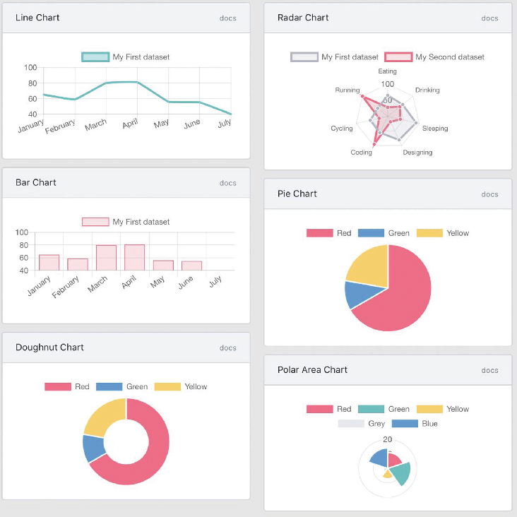
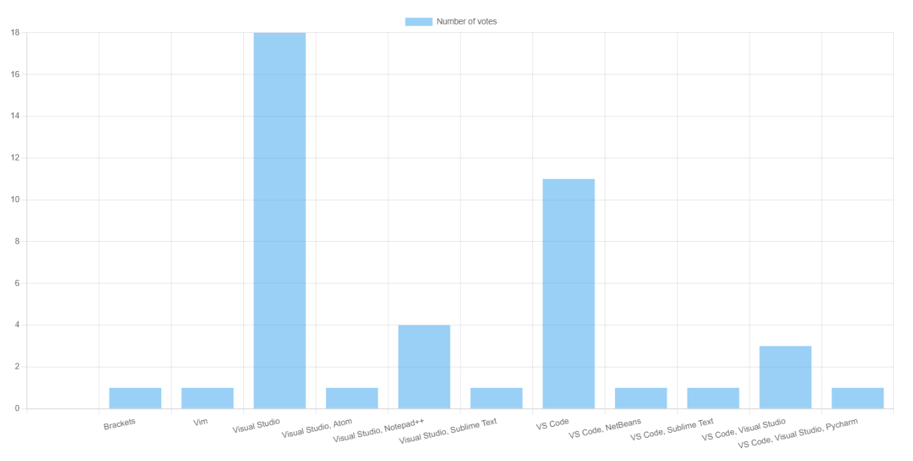

# Graphs and Charts in Razor Pages

## Types of Charts
</img>
<figcaption><a href="https://www.researchgate.net/publication/341152733_InnoMetrics_Dashboard_The_Design_and_Implementation_of_the_Adaptable_Dashboard_for_Energy-Efficient_Applications_Using_Open_Source_Tools/figures?lo=1&utm_source=google&utm_medium=organic">source</a></figcaption>

## Drawing charts with Chart.js

### Setup
1. Once you have your project created on Visual Studio, right-click on your project, and select _Manage client-side libraries_
1. A `libman.json` file will open up. Add the chartjs library to it.

```js
{
  "version": "1.0",
  "defaultProvider": "cdnjs",
  "libraries": [
    { //add this block of code
      "library": "Chart.js@4.3.0",
      "destination": "wwwroot/lib/chartjs"
    }
  ]
}
```
3. Hit Ctrl-S to save and Visual Studio will download the package to your destination folder (wwwroot/lib/chartjs in this case).
4. Install the latest version of **Newtonsoft.Json** from NuGet.
5. Inside this repository, you'll find a folder named `Chart`. You need to add it to your project inside a Models folder. (To do that, you may clone the whole repository into your local machine then copy the folder. Or you can manually create the files and copy the contents off of the repo on github.)
6. Once you have your models in a folder in your project, the next step is to add the JavaScript to the `_Layout.cshtml` as the last line in HTML:
```html
<script type="module" src="~/lib/chartjs/chart.umd.js"></script>
```

### Creating and displaying the chart
#### Inside the view (Index.cshtml):
1. Create a canvas
```html
<div class="chart-container" width="600" height="400">
    <canvas id="barChart"></canvas>
</div>
```
2. Add the script to create the chart, below the HTML code.
```html
<script type="module">
    document.addEventListener('DOMContentLoaded', (event) => {

        var ctx = document.getElementById('barChart'); 
        var myChart = new Chart(ctx, @Html.Raw(Model.ChartJson) );
    });
</script>
```

Now we need to write the actual logic to generate the chart.

#### Inside the view model (Index.cshtml.cs):
1. we need to create two class properties; one to carry a ChartJs object, and another to carry the JSON equivalent of that object - which will be passed to the frontend later.

```cs
public class IndexModel : PageModel
{
    public ChartJs BarChart { get; set; }
    public string ChartJson { get; set; }

    public IndexModel(DB db)
    {
        BarChart = new ChartJs();   // must initialise the ChartJs object in the constructor
        this.db = db;
    }

    public void OnGet(){} 
}   //end of class
```

3. In the `OnGet()`, we will make a call to two functions. 
    - The first is a function from the DB class which will be responsible for getting the data and returning it in a format that can be used by the ChartJs object, `getFavouriteCodeEditors()`. 
    - The second is a private class function that will receive the data from the first function and inject it into the ChartJs object then send it to the frontend in JSON format, `setUpBarChart()`.

```cs
    public void OnGet()
    {
        Dictionary<string, double> favCodeEditors = db.getFavouriteCodeEditors();

        setUpBarChart(favCodeEditors);
    } 
```

4. Let's define `setUpBarChart()` first:

```cs
    private void setUpBarChart(Dictionary<string,int> dataToDisplay)
        {
            try
            {
                // 1. set up chart options
                BarChart.type = "bar";
                BarChart.options.responsive = true;

                // 2. separate the received Dictionary data into labels and data arrays
                var labelsArray = new List<string>();
                var dataArray = new List<double>();

                foreach (var data in dataToDisplay)
                {
                    labelsArray.Add(data.Key);
                    dataArray.Add(data.Value);
                }

                BarChart.data.labels = labelsArray;

                // 3. set up a dataset
                var firsDataset = new Dataset();
                firsDataset.label = "Number of votes";
                firsDataset.data = dataArray.ToArray();

                BarChart.data.datasets.Add(firsDataset);

                // 4. finally, convert the object to json to be able to inject in HTML code
                ChartJson = JsonConvert.SerializeObject(BarChart, new JsonSerializerSettings
                {
                    NullValueHandling = NullValueHandling.Ignore,
                });
            }
            catch (Exception e)
            {
                Console.WriteLine("Error initialising the bar chart inside Index.cshtml.cs");
                throw e;
            }
        }
```
5. Now let's define `getFavouriteCodeEditors()` inside DB.cs:

```cs
    public Dictionary<string, int> getFavouriteCodeEditors()
        {
            Dictionary<string, int> labelsAndCounts = new Dictionary<string, int>();

            try
            {
                con.Open();

                string query = "select code_editor, count(code_editor) as count from student_info group by code_editor";

                SqlCommand cmd = new SqlCommand(query, con);

                SqlDataReader sdr = cmd.ExecuteReader();

                // store labels and counts inside the dictionary
                while (sdr.Read())
                {
                    labelsAndCounts.Add(sdr["code_editor"].ToString(), (int)sdr["count"]);
                }
            }
            catch (Exception e)
            {
                throw e;
            }
            finally { con.Close(); }

            return labelsAndCounts;
        }
```

Output:



## Resources and Other Ways of Drawing Charts
- You may look into Google Charts. It has a fairly similar setup to ChartJs. Here's an article about [Integrating Google Charts in ASP.NET Core](https://dotnetthoughts.net/integrating-google-charts-in-aspnet-core/)
- [Using Google Charts in ASP.NET Core Web App](https://www.youtube.com/watch?v=mksUls9fx-Q)
- You may look into the Chart Helper, but it only works for .NET Framework projects. It does not work for .NET Core.
- Main Reference: [Building charts with razor pages](https://www.danylkoweb.com/Blog/aspnet-core-building-charts-with-razor-pages-QR)
